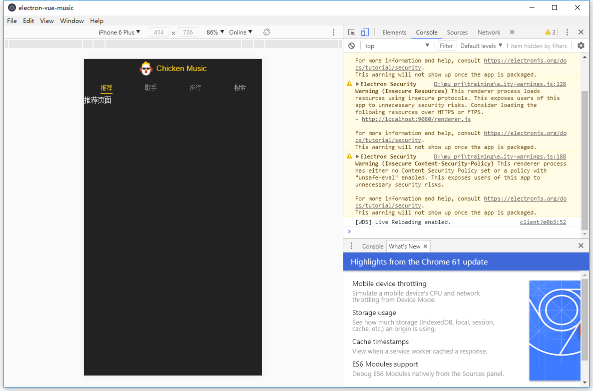

# 第2章 项目准备工作

## 2.1 需求分析

* 右上角：`用户中心入口`按钮
* 导航栏
  * `推荐`
    * `轮播图`
    * 推荐的`歌单列表`：点击跳转->`歌单详情页`
  * `歌手`
    * 左侧`歌手列表`：点击跳转->`歌手详情页`
    * 右侧`歌手字母导航`
  * `排行`
    * `排行列表`：点击跳转->`歌单详情页`
  * `搜索`
    * `搜索框`
    * 无搜索内容时
      * `热门搜索区块`
      * `搜索历史`
    * 有搜索内容时
      * `搜索结果列表`包括歌曲和歌手：点击歌手跳转->`歌手详情页`；点击歌曲->`播放歌曲`

* 播放器
  * 左上角：`折叠`按钮，点击跳转->`歌单详情页`
  * `歌曲名称`
  * `歌手名字`
  * 封面模式
    * `歌曲相关图片`（播放器背景虚化图片也是该图片）
    * 当前那句`歌词`
  * 歌词模式
    * `歌词列表`
  * `播放进度条`
  * `控制播放`按钮组

* 迷你播放器
  * 左：`歌曲封面` + `歌名` + `歌手名字`
  * 右：`播放/暂停`按钮 + `歌单`按钮
    * 点击`歌单`按钮，下方弹出`播放列表`，点击页面上方
      * 上左：`播放模式`按钮
      * 上右：`删除`按钮
      * 中：歌曲列表：左`歌名`，右`喜欢`按钮+`删除`按钮
      * 下：`添加歌曲到队列`按钮-> 跳转到`添加歌曲页面`
      * 最下：`关闭`按钮

* `添加歌曲到列表页面`
  * 搜索框
  * 有搜索内容时
    - `搜索结果列表`包括歌曲和歌手：点击歌手跳转->`歌手详情页`；点击歌曲->`播放歌曲`
  * tab 页
    * 最近播放列表
    * 搜索历史

* `用户中心页面`
  * 切换按钮：
    * 我喜欢的 
    * 最近听的
  * 随机播放按钮
  * 歌曲列表


## 2.2 初始化项目

鉴于我要使用 Electron 框架，所以这节内容跟课程不同

### 安装

```shell
npm install -g vue-cli
vue init simulatedgreg/electron-vue electron-vue-music
```

在执行过程中，除了有关测试方面的选项输入 `n`,其他都可以默认回车或者输入`y`

ps: 如果在过程中问安不安装 `sass`，先选择`n`，教程中用的是`stylus`，我们后面再手动安装。

### 运行

```shell
cd electron-vue-music
yarn # or npm install
yarn run dev # or npm run dev
```

成功启动了 electron-vue 的默认页面


## 2.3 项目目录介绍

教程的项目是在`src`文件夹下

Electron 项目是在 `src/renderer`文件夹下

```
├── api # 放置跟后端请求相关的代码，比如 jsonp 或 ajax
├── common # 放置通用的文件
|	├── fonts
|	├── image
|	├── js
|	└── stylus # 通用的样式
├── components # 通用组件，删掉 electron-vue 自带的默认 Landpage 文件们
├── router
└── store
```

### 拷贝项目代码

将 `Chapter 2` 分支的[代码](<https://github.com/ustbhuangyi/vue-music/tree/chapter2>)下载下来。

然后将其中的

```
├── api
├── common
├── components
├── router
├── store
└── App.vue
```

全部拷贝并覆盖到`src/renderer`下面

`main.js`，不拷贝，因为我的electron 项目对 `main.js` 有自己的设置，但需要把样式导入进来

```js
import 'common/stylus/index.styl'
```


### 其他额外工作

1. 修改 `.eslintrc.js`

   1. 增加 `eol-last: 0` 不去检查每个文件最后一行是否是空行
   2. 增加`space-before-function-paren: 0` 不去检查函数名和括号之间有没有空格

2. 安装 `stylus`

   `npm install stylus-loader stylus --save-dev`

3. 配置 `stylus` 。不确定是否只有 electron 项目需要额外配置。增加如下内容

   ```javascript
   module: {
       rules: [
           {
           	test: /\.styl(us)?$/,
           	use: ['vue-style-loader', 'css-loader', 'stylus-loader']
           },
           {
               test: /\.vue$/,
               use: {
                 options: {
                   loaders: {
                     stylus: 'vue-style-loader!css-loader!stylus-loader',
                     styl: 'vue-style-loader!css-loader!stylus-loader'
                   }
                 }
               }
         	}
       ]
   }
   ```

4. 增加 webpack 的 resolve 别名

   教程项目是在`build/webpack.base.conf.js` 增加的内容为

   ```javascript
   resolve: {
    alias: {
        'common': resolve('src/common'),
        'components': resolve('src/components')
    }
   }
   ```
   electron 项目是在 `.electron-vue/webpack.renderer.config.js`，增加的内容为

   ```javascript
   resolve: {
       alias: {
           'common': path.join(__dirname, '../src/renderer/common'),
           'components': path.join(__dirname, '../src/renderer/components')
       }
   }
   ```


至此，electron 可以运行`yarn run dev`，样子如下



