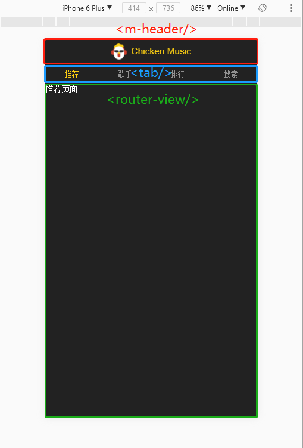

# 第3章 页面骨架开发

## 添加移动端常见 meta 设置

在 `index.html` 中，添加一个` meta` 标签，设置一些移动端的常用设置：

```html
<meta name="viewport" content="width=device-width, initial-scale=1.0, maximum-scale=1.0, minimum-scale=1.0, user-scalable=no">
```

为了在移动端，不能让用户（通过手势）进行缩放页面。


在我的 Electron 项目中，是在 `src/renderer/index.ejs`，但我的项目是运行在电脑上，所以就不加了。


## 解决移动端点击 300毫秒延迟问题 

在 `dependencies` 中增加 `fastclick`

并在 `main.js` 中使用

```js
import fastclick from 'fastclick'
fastclick.attach(document.body)
```

> [这里](<https://thx.github.io/mobile/300ms-click-delay>)有一篇 300毫秒历史问题的前世今生，上面的移动端禁止缩放的原因也包括在内。
>
> 简单概括一下就是，移动互联网发展前期，双击是缩放页面，点击是跳转，`iOS` 为解决当用户点了第一下，到底是单击，还是待会还会再点一下表示双击，这个问题，延迟300毫秒等待用户的第二次点击，如果没等到，就发出 `click` 单击信号。
>
> 但后面移动互联网蓬勃发展，去你大爷的老子就要快，点一下让用户等300毫秒不能忍，于是浏览器们开始打补丁，包括上面添加 `meta` 标签信息禁止缩放以及 [fastclick](<https://github.com/ftlabs/fastclick>) 点击就发射`click`信号的库的出现。


**PS： 我的 electron 项目依旧不加**

## 解决 es 语法兼容的问题

在 `dependencies` 中增加 `babel-runtime`

在 `devDependencies` 中增加 `babel-polyfill`

在 `main.js` 中使用。只需导入即可

```js
import 'babel-polyfill'
```


## 路由配置

将四个 tab 页对应的组件都在 `router/index.js`里注册到 router 里

```js
Vue.use(Router)

export default new Router({
    routes: [
        {
            path: '/recommend',
            component: Recommend
        },
        {
            path: '/singer',
            component: Singer
        },
        {
            path: '/rank',
            component: Rank
        },
        {
            path: '/search',
            component: Search
        }
    ]
})
```

为了使页面初始加载，使得有默认显示的组建，可在上述文件增加一条`route`

```js
{
    path: '/',
    component: Recommend
}
```


## tab 页切换功能

页面骨架 `App.vue`



通过点击 tab 栏的项，控制` <router-view> `显示的内容。

```js
<router-link tag="div" class="tab-item" to="/recommend"><span class="tab-link">推荐</span></router-link>
<router-link tag="div" class="tab-item" to="/singer"><span class="tab-link">歌手</span></router-link>
<router-link tag="div" class="tab-item" to="/rank"><span class="tab-link">排行</span></router-link>
<router-link tag="div" class="tab-item" to="/search"><span class="tab-link">搜索</span></router-link>
```

但某个 route 被激活的时候，对应的 router-link 会增加一个 class 名字`router-link-active`,可以在样式里设置，被激活的那个 router-link 渲染的元素的激活样式：修改字体颜色 和 设置底部 border

```stylus
&.router-link-active
	.tab-link
		color: $color-theme
		border-bottom: 2px soild $color-theme
```

