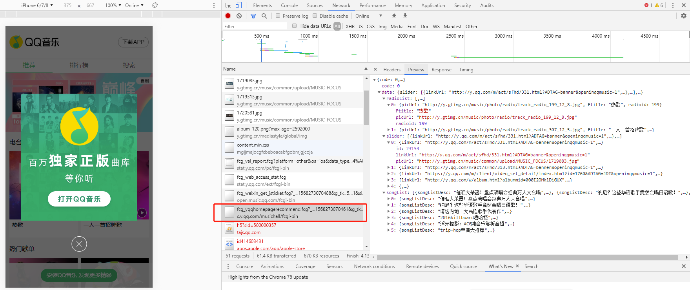
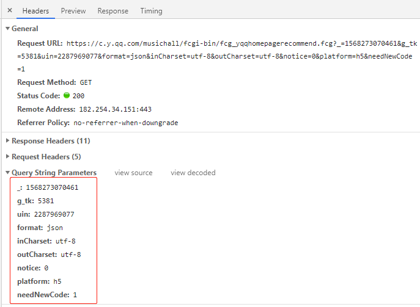

# 第4章 推荐页面开发

## 数据获取

项目的数据来自 [QQ 音乐](<https://y.qq.com/>)。

我们通过 `Chrome` 浏览器的调试工具，在 `Network` 中发现，~~QQ 音乐请求数据是通过 `jsonp` 的形式获取的~~。

20190916，QQ音乐得数据请求并不是 jsonp 形式。就是普通的返回json。




### jsonp 原理

[jsonp](<https://github.com/webmodules/jsonp>) 解决**跨域**请求数据问题。但是只能发 `GET` 请求

> Web 知识空白如我，自然得去了解一下什么是跨域，为什么会有跨域等这些背景。
>
> [这里](<https://segmentfault.com/a/1190000015597029>)有篇文章比较通俗易懂讲了下跨域问题以及几种解决方法。
>
> 简单总结：为了保证用户访问网站的**安全**，浏览器有[同源策略](<https://developer.mozilla.org/zh-CN/docs/Web/Security/Same-origin_policy>)。
>
> 安全是挺安全的，但把坏人挡到外面的同时，把正人君子想做正经请求也给拒之门外了。
>
> 于是（在同源策略限制下的）跨域方式，百花齐放（并不！）。`jsonp` 就是其中一种。


需要前端和后端配合。

这里不对 `jsonp` 详细展开了，因为QQ音乐的获取方式变化了，跟教程那会儿不一样了。

我们参考[纯正商业级应用-微信小程序开发实战](https://coding.imooc.com/class/251.html) 中的第11-5,11-6,11-7 关于使用`Pormise`封装 http请求章节内容，


### 封装请求

通过查看请求的 `Headers`那一栏，找到请求的参数。

* **url**: `'https://c.y.qq.com/musichall/fcgi-bin/fcg_yqqhomepagerecommend.fcg'`
* 查询参数中，有一些之后的请求也会用到，可以把他们放在 `config`里。



在 `api/config.js`中

```js
export const commonParams = {
  _: 1568273070461,
  g_tk: 5381,
  format: 'json',
  inCharset: 'utf-8',
  outCharset: 'utf-8',
  notice: 0
}

export const ERR_OK = 0

```


先封装一个，将参数合并成 url 格式的工具函数。

在`common/js/https.js`中

```js
function paramConnect(data) {
  let result = ''
  for (let i in data) {
    let value = data[i] !== undefined ? data[i] : ''
    result += `&${i}=${value}`
  }
  return result ? result.substring(1) : ''
}
```

我们使用 `fetch` (先安装 `node-fetch`)来做 https 的请求。

在 `common/js/https.js`中

```js
import fetch from 'node-fetch'

export function https(url, data) {
  let param = paramConnect(data)
  url = url + '?' + param
  return new Promise((resolve, reject) => {
    fetch(url).then(res => {
      resolve(res.json())
    })
  })
}
```

 基础函数都写好了，我们终于可以写获取 recommend 的函数了

在 `api/recommend.js`中

```js
import {commonParams} from './config'
import {https} from 'common/js/https'

export default function getRecommend() {
  const url = 'https://c.y.qq.com/musichall/fcgi-bin/fcg_yqqhomepagerecommend.fcg'
  const data = Object.assign({}, commonParams, {
    uin: 2287969077,
    platform: 'h5',
    needNewCode: 1
  })
  return https(url, data)
}

```

### 组件中使用

在`components/recommend/recommend.vue`中

```vue
<script type="text/ecmascript-6">
  import getRecommend from '@/api/recommend'
  import {ERR_OK} from '@/api/config'

  export default {
    created() {
      this._getRecommend()
    },
    methods: {
      _getRecommend() {
        getRecommend().then(res => {
          if (res.code === ERR_OK) {
            console.log(res.data.slider)
          }
        })
      }
    }
  }
</script>
```


## 轮播组件的开发

我们需要依赖一个第三方库`better-scroll`

这里就不详细写笔记了，太零碎。


## 优化

### keep-alive

因为获取QQ音乐数据是在 mounted 里，每次我们切换顶端 tab，切回推荐页的时候，就又会去请求数据、重新渲染，用户体验不好而且还浪费。所以，我们可以在 `<router-view/>` 外面包裹`<keep-alive>`来避免上述事情发生。

关于 keep-alive ，请参考[官方帮助](<https://cn.vuejs.org/v2/guide/components-dynamic-async.html>)

### vue-lazyload

使用第三方懒加载插件[vue-lazyload](https://github.com/hilongjw/vue-lazyload)，来实现首屏图片懒加载。

### click 事件

因为前面我们使用了 `better-scroll` 和 `fastclick`插件，两者在鼠标点击事件上有冲突，`fastclick`会把 `better-scroll` 的 `click` 事件给拦截了，导致被 `BScroll` 封装的 `dom` 元素点击没反应。

解决办法是，`fastclick` 提供了 `class` 名字`needsclick`，如果`dom` 的`class` 名字包含了它，则不会去阻止 `click` 事件。

```html

```

